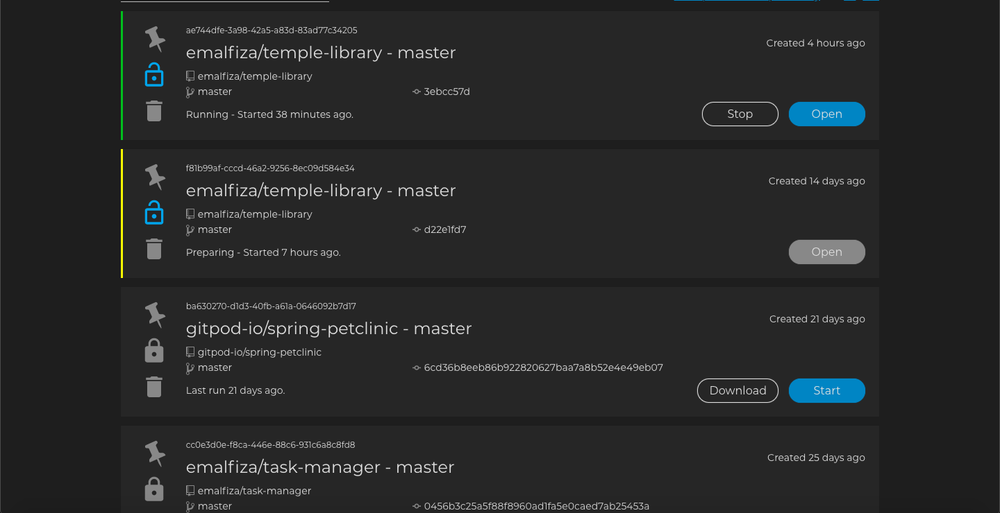

# Data Centric Development Project
---

## App Name: Temple Library -

#### [See here for a deployed app]()
It is no secret that I love books.  Though I prefer the printed book, I also have electronic collections on every device imaginable.  
From speaking about the [WE SHOULD ALL BE FEMINISTS ](https://www.chimamanda.com/book/we-should-all-be-feminists/) or how 
[BOOKS MAKE A BETTER LIFE](https://www.skipprichard.com/books-make-a-better-life/) to visiting bookstores and libraries, I want 
to share this passion with you all through this Temple Library page, which is built with love and warmth. 

Charlie “Tremendous” Jones was one of great influencers. He repeatedly said that, “You will be the same person you are today in five years 
but for two things: the people you meet and the books you read.”

Books change lives


## Project Purpose 
---
This project was developed to create an App to make life easier for a librarian (users) in the smallish library at a school or college at some point. As a student when I completed the Data-Centric Development module, I explored a whole lot of cooking apps and recieps apps developed by so many coders, at meanwhile a great friend of mine, my inspiration to coding recommended me this project. He introduced the concepts of not only building an app for mark for the Code Institute required milstone project, rather than building an app to be used at some smallish libraries at some point to make me understand the concepts of apps in the development process. 


## Quick guide
---
#### Home Page
-**Browse Books** The users added books appear in a simplistic and userfriendly way in columns and rows, the most recent entries on the last column. 
-**Columns and Rows** Each column and row consist the book cover, book name, book writer and genre. All the book names are linked to the viewbook page which can take you to that page by clicking the book name. 


#### Add Book Page
-**Add Book** The page consists of a search by ISBN text fields and search button right at the top of the page to give the users the ease to search for book info by ISBN requesting google API. During the development process of the App, I considered the option to presents the users the ability to manually add book info. Add manually consists of five text fields. Book name, writer name, genre, cover art link and a description and as well as a submit button beneath. 
Adding book info by ISBN or adding manually after submitting pilots the users back to Home Page appearing the book down at the bottom.


#### Viewbook Page
-**Viewbook** Accessing the Viewbook page is via the Home Page of the App. After clicking the book name, you will land on the viewbook page. 
Viewbook is consists of a title of the book, book name, writer name, book genre, book cover and description that only appears on this page.
There are two buttons, Edit Book and Remove Book to cover the rest of the CRUD functionality. 


#### Edit Book
-**Edit Book** Accessing the Edit Book page is via the Viewbook Page of the App. After clicking the Edit Book button, you will land on the Edit Book page.
Edit Book page is a simplistic form field. After completing the form and clicking the submit button will pilot, you back to the home page updating the entry for the users. 


#### Remove Book
-**Remove Book** Simply by clicking the Remove Book button. You will land back to the home page of the App and the book entry nomore available.

#### About Page
-**About Page** Accessing the About page is via the Navbar of the App. After clicking the info icon. You will end up on the About Page which gives the users the info about our mission, our vision and our values. 

![About Page Mobile View]

#### [See here for Wireframes](static/wireframes)


## UX
---
### User stories
The UX has been designed with the end user in mind and as expectations in terms of front-end design are ever increasing, I opted to utilise Materialize.css for my design and responsive layout. Materialize.css is a library of UI components designed by Google with the aim of providing a unified and consistent user experience.

#### All visitors to the site will expect/want/need:
- The images and text content to be helpful, understandable and bring about a positive response or interesting experience.
- To easily find what I am looking for. I want the layout of the site to make sense so I am not confused, frustrated or bored using it.
- The information I am presented with to be laid out in a way that is easy for me to navigate, so that I find what I need quickly and efficiently then return to the home page immediately. 
- I do not want to leave the site when I follow the links then lose the tab for the relevant original page.
- As a user accessing this site from a mobile phone or tablet, I want the site to have been designed responsively so that it is still easy to navigate and use on my smaller devices. 

#### Users (librarians) will expect/want/need:
- I am often busy so do not want to enter all the books info one by one and spend too long filling in forms or struggle to submit them. 
- To simply find what I am looking for. 
- To store the info which is valued.


## The Structure plane
---

Considering what would be logical and reasonable Data-centric project is about usibility more than being fancy and decorated, That is why I kept the default material feeling and considering intuitive  IA (Information Architecture), the structure has been kept as simplistic as possible on App.

Information architecture is just a small part of the User Experience but imperative to achieve the functionality without either users or user/contributors losing interest and leaving the site.
The structure below was considered to develope a good Information Architecture.


## MongoDB Atlas
---

MongoDB Atlas was recommended by Code Institute. 
MongoDB was the perfect choice for this project.
The Mongo DB documentation and Code Institute tutorials were very helpful. MongoDB data creation was the first step for this App. 


## Features
---
The main features of the App are:
- Clear and easy to use the navigation
- The default materialize design
- Fully responsive to all screen sizes
- An online repository of Library book with Create, Read, Update and Delete functionality and use of Google API.
- An About page and social media channels on the footer.

## Future developments
---
Adding the ability to create users and borrowing books collection into the MongoDB and routing them to the App by adding more pages will be considered for the future if I find the group for using this App. Obviously, creating a contact page would be a great enhancement to make in the future. 


## Technologies Used
---
1. [HTML5](https://en.wikipedia.org/wiki/HTML5) - Semantic markup language as the shell of the site.
2. [CSS](https://en.wikipedia.org/wiki/Cascading_Style_Sheets) - This was used to style the elements of the HTML code.
3. [MATERIALIZE](https://materializecss.com/about.html) - HTML forms, icons, templates with nav bar, buttons and footer.
4. [PYTHON3](https://www.python.org/download/releases/3.0/)
5. [FLASK](https://flask.palletsprojects.com/en/1.0.x/) - Framework to construct and render pages.
6. [MONGODB_ATLAS](https://www.mongodb.com/cloud/atlas) - For nonsql database
7. [GITPOD](https://www.gitpod.io) - IDE 
8. [HEROKU](https://heroku.com/) - Deployment
9. [GITHUB](https://github.com) - Used for version control 
10. [Typora](https://typora.io/) - Language for Readme.md file
11. [PYMONGO](https://api.mongodb.com/python/current/) - To make communication between Python and MongoDB possible
12. [PIP and Pypi libraries]
13. [JQUERY](https://code.jquery.com/jquery-3.3.1.slim.min.js) - jQuery was used to search for book info by ISBN from Googple API
14. [JINJA](https://jinja.palletsprojects.com/en/2.10.x/) - To simplify displaying data from the backend of this project smoothly and effectively in html.
15. [BALSAMIQ](https://balsamiq.com/wireframes/) - Wireframe design
16. [GOOGLE FONTS](https://fonts.google.com/) - Exo 2 font family selected for all the elements
17. [Am I Responsive?](http://ami.responsivedesign.is/#) - Was used for the responsiveness of the app.


## Testing
---

### Early development testing.

1. Code Institute student care team advised me to start using Gitpod IDE for my 3rd milestone project. but the lack of extensions available meant that I would still used PyCharm to check python syntax and test if the code would run. 

For example, in the earliest phase of development I did not understand how crucial tabs and extra spaces were in Python. It was not always clear in gitpod IDE. Copying the code in to Pycharm helped test and resolve issues.

3. Chrome Devtool was used from the outset to judge the responsiveness of the site and help test the layout and css styling. 

For example, 
When choosing the Materialize components to add in early development I added each one then used Chrome Devtools to check the responsiveness before I used them in the design of the site.

### Mid development Testing

1. All the above tests continued to be used throughout. 
PyCharm, GITPOD, DEVTOOLS, HTML VALIDATOR, GitHub and HEROKU. 

2. Nearly 60% t0 70% through to the developemnt of this app, I wanted to check the app on the Heroku and send it to my mentor Brian Macharia for potential check. I used to get an Application Error and I contacted tutor help and it took me a complete day to resolve the issue with Tim. The issue was that I didnt know at that stage of time that I should have setted MONGO_URI on the heroku config var. 

### Final Testing to demonstrate thorough testing carried out throughout development.

1. I was almost done with all the functionality of the app. wanted to do some code cleaning, checking the debugs and update README.md but I faced with a problem. version controlling to the github pages where normal but nothing, no updates were showing on the GitHub pages. Again tutor help and Haley helped me with the issue which was a difference between what's on github and what's in workspace. that meant there were something recorded in my github were it was different from my workspace. so then I found out that there was conflict on my README.md file so I had to use the following command:
```
git push origin master --force
```
2. on day 14 of developing this App. In the morning of 12th of Feberuary 2020 I wanted to test and do some house keeping of my App the Gitpod IDE stopped running the project. As usal there are two buttons for each workspace `download` `start`, or if it's a running workspace it shows two button `stop` `open`, but temple-library workspace was showing only one disablled button `open` I tried troubleshooting, realoading the page, clearing the cache, logging out and logging none of them worked. CI tutor help recommended me to open a new workspace and working from there. I condcuted the following methods:

- opened the pushed code from the GitHub pages. Make sure to select the gitpod green button to record your commiting on the same recorded github. 
- insall the python modules. using the existing `requirements.txt file`. To install used `pip3 install -r requirements.txt`.
- make sure to create a env.py file for the MONGO_URI

<details>
<summary>Gitpod fault screenshot</summary>

<p align="center">
    
</p>
</details>


### MongoDB test

MongoDB Atlas were manually added key value pair on my collection and checked all working from the frontend too.

All CRUD functionality is working correctly.

##  Responsive Design - Temple Library app is fully responsive; 

1. For the final tests, as throughout the entire development and design process, I continuously tested a multitude of screen sizes using Chrome Developer tools. Each time there was a change in navigation, design, functionality etc., how it looked on every size screen was always checked. At the final when I was happy with everything I checked the responsiveness on the [Am I Responsive](http://ami.responsivedesign.is/#)

It was found during final user device tests that individual phone settings, on any mobile screen size the Navbar logo font size was overlapping and line breaking on the viewport this all fixed by setting media query and as well as the h4 and h5 font size was very large for the small screens as it was the materialize default font size setup which was not really visually appealling so again media query added. 


## Compatibility
---

To ensure a broad range of users can successfully use this site, I tested it across the 6 major browsers in desktop, tablet and mobile configuration. Different versions used by friends and other students. No issues.

1. Chrome

2. Edge

3. Firefox

4. Safari

5. Opera

#### Devices tested

Mobile phones
- Samsung j5
- Samsung A8
- Iphone 6
- Iphone7
- Iphone 7S plus,
- Sony XA42

Tablets tested
- Ipad
= LNBEI 10 inch Android tablet

Laptop tested
- MacBook pro,
- Sony Vaio
- HP Pavillion DV6

Desktop
(unbranded Windows 7 OS) with different monitors 21 and 27inch.

## File Structure
---

The project has been organised as follows:

```
ROOT DIRECTORY
(Project Folder)
static (folder)
templates (folder)
gitignore (file)
env.py(file)
Procfile (file)
README.md (file)
requirements.txt (file)
```

#### Gitignore

```
env.py
```

The static folder structure is as follows:

```
static (folder)
   CSS (folder)
      style.css (file)
   images (folder)
      (image files)
   js (folder)
      main.js(file)
   wireframes (folder)
```

The various pages for this app are in the templates folder. This folder contains the following html templates:

```
templates (folder)
   about.html (file)
   addbook.html (file)
   base.html (file)
   editbook.html (file)
   index.html.html (file)
   viewbook.html (file)
```


## Version control and Heroku Deployment
---

For version control Github has been used. Github is a distributed Version Control Systems (DVCSs) recommended by Code Institute which ensures we have a store of all significant changes made during development.
Using Gitpod alongside Github had major advantages in terms of how easy it was to stage, commit and push versions but I did get confused in the early days of using Gitpod because opening up previous versions and trying to save them did not commit as the most recent version which led to a number of different 
eventho my version control for this entire App was still the same on the terminal.
```
git status 
git add .
git commit -m ""
```

Github initial commit to repository and first heroku build were created on the same day. 
Version control and Heroku deployment were initially done separately in the command line (Method one below) then as better understanding of gitpod and heroku was grasped, all significant version changes were pushed to github and automatically deployed to heroku once the app was connected to the github repository (Method two below).

In summary, two methods of deployment were used.
To deploy Temple Library App to heroku, the following steps were taken:

### Method one 
Initially, for each version I initially pushed separately to either github and and heroku. 

I began deployment via the CLI in gitpod workspace terminal using the following commands until I saw the build log in heroku or github repository showed successful deployment and/or new version commit:

```
npm install -g heroku

heroku login -i

git status

git add 

git commit -m "initial commit"

git remote add heroku

git push -u heroku master

git remote -v

pip3 freeze --local > requirements.txt

echo web: python app.py > Procfile
```


Initially I separately added to the github repository.

```
git add 
git commit -m ""
git remote add (my repository named temple-library)
git push -u origin master
```

### Method two 

As CI students on the slack recommended connecting github pages to Heroku for automated deployments. I connected Heroku to github and selecting automatic deploys. 

From that point on gitpod push to github automatically deployed to heroku and so github version control and heroku build log mirrored each other perfectly. 


##### Step by Step deployment from fresh gitpod terminal workspace would be. 

1. Checked requirements.txt file using the terminal command pip freeze > requirements.txt.

2. Checked Procfile with the terminal command echo web: python app.py > Procfile.

3. Stage changes in gitpod. Write a commit message, click on the tick icon then push to Github.

4. Create a new app on the Heroku website by clicking the "New" button in your dashboard. Give it a name and set the region to Europe.

5. From the heroku dashboard of your newly created application, click on "Deploy" > "Deployment method" and select GitHub.

6. Confirm the linking of the heroku app to the correct GitHub repository.

7. In the heroku dashboard for the application, click on "Settings" > "Reveal Config Vars".

Set the following config vars:

Key	Value

IP	0.0.0.0

PORT	5000

In the heroku dashboard, click "Deploy".

In the "Manual Deployment" section of this page, made sure the master branch is selected and then click "Deploy Branch".

The site is now successfully deployed.

## Credits
---

### Author 

Emal Fiza Full Stack Student at Code Institute

### Media

### Inspiration

I received inspiration for this project after meeting my personal guide Housam Ziad. He made me understand the concepts of building an App to be useful rather than for mark as a student and I believe this is a step forward in the development process.

### Acknowledgements

Housam Ziad for the motivation and encouragement, My mentor Brian Macharia for his clear direction.
The tutor team support has been excellent as always especially Tim, he is always there to help with joy and happiness. Slack community CI students and mentors. 


### Submission
---

#### Assessment Criteria review

My previous submitted projects developed me in the process to be aware of the Assessment Criteria in order to build an App to the standard of the Code Institute. So this time I have targeted to fulfil all the assessment criteria below to a standard beyond that expected. 

Your Data Centric Development project will be assessed based on the following criteria:

Usability and Visual Impact:
Project Purpose, 
UX design,
Suitability for purpose,
Navigation,
Ease of use,
Information Architecture,
Defensive Design,

Layout and Visual Impact:

Responsive Design,
Image Presentation,
Colour scheme and typography

Code Quality:

Appropriate use of HTML,
Appropriate use of CSS,
Appropriate use of Python,
Appropriate use of the template language

Software Development practices:

Directory Structure and File Naming,
Version control,
Testing implementation,
Testing write-up,
Readme file,
Comments,
Data store integration,
Deployment implementation,
Deployment write-up
